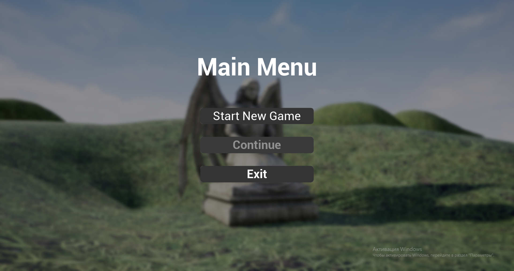
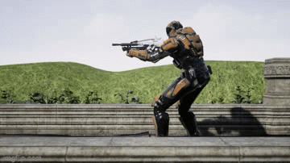
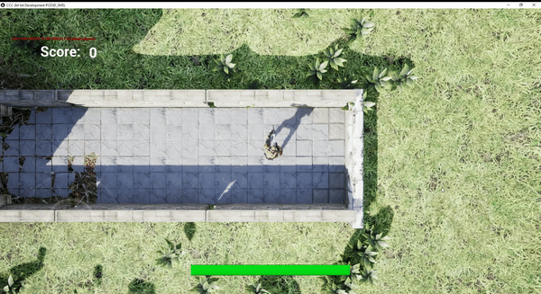
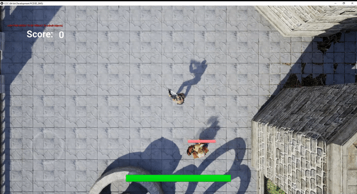

# Dwarf Shooter
Созданно на основе курсов devToDev
____
## 1. Главное меню
Реализованы две кнопки:
+ Start New Game — открывает единственный игровой уровень
+ Exit — закрывает приложение
+ Кнопка Continue недоступна

____
## 2. Cinematic
Сразу после запуска MainMap проигрывается синематик, состоящий из 3 кадров:
### Первый кадр

### Второй кадр

### Третий кадр

## 3. Управление
Игра предназначенна для мобильных устройств, поэтому для управления персонажем используются встроенные DefaultVirtualJoysticks. В целях облегчения процесса разработки была оставленна возможность использования Input с клавиатуры.
Стрельба осушествляется непосредственным успользованием левого джойстика. Поворот персонажа не зависит от поворота контроллера.

## 4. Враги и взаимодействие с ними!

Спавнятся дворфы волнами в случайно выбранных точках. За из поведение отвечает простой BehaviourTree, согласно которому они пытаются сразу же сблизится с игроком, а при достаточно близком расстоянии до цели начинается анимация атаки.
И враги, и игрок имеют свою шкалу здоровья.

## 5. VFX
Для создания искр от попадания и огня от стрельбы используются системы частиц.

